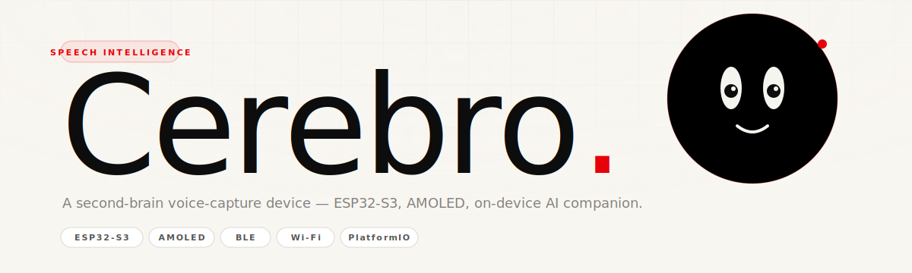
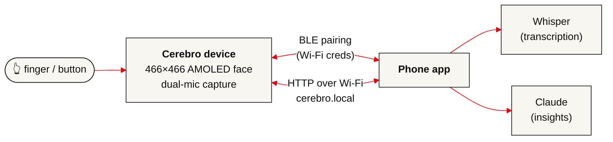

<div align="center">
  
</div>

<p align="center">
  
  
  
  
</p>

<br/>

> **Cerebro** is a second-brain voice-capture device. Hold it, press the button, speak. The device records, ships the audio to your phone over Wi-Fi, and your phone handles transcription and AI insights. This repo is the **firmware** — everything that runs on the device itself.

<br/>

## What's in here

A single PlatformIO project for the **Waveshare ESP32-S3-Touch-AMOLED-1.75C**. The firmware draws a live animated face on the 466×466 round AMOLED screen, tracks your finger with its eyes, responds to the BOOT button, pairs to your phone over BLE, connects to Wi-Fi, exposes an HTTP API, captures audio from the dual-mic array, and plays audio back through the onboard speaker.

<br/>

## At a glance

| | |
|---|---|
| **Board** | Waveshare ESP32-S3-Touch-AMOLED-1.75C |
| **SoC** | ESP32-S3R8 · 8 MB PSRAM (octal) · 16 MB Flash |
| **Display** | 1.75" round AMOLED · 466×466 · CO5300 QSPI |
| **Touch** | CST9217 capacitive · I²C |
| **IMU** | QMI8658 6-axis · I²C |
| **Audio** | ES7210 ADC (dual mic, echo cancel) + ES8311 DAC + onboard speaker |
| **Power** | AXP2101 PMU · Li-ion battery |
| **Radio** | Wi-Fi 2.4 GHz · Bluetooth 5 LE |
| **Build** | PlatformIO · Arduino-ESP32 · Arduino_GFX 1.5.6 |

<br/>

## Quickstart

```bash
# 1. Clone
git clone https://github.com/KezLahd/cerebro-firmware.git
cd cerebro-firmware

# 2. Install PlatformIO (if you don't have it)
#    https://platformio.org/install/cli
pip install platformio

# 3. Plug the device in via USB-C and flash
pio run --target upload

# 4. Open the serial monitor to watch it boot
pio device monitor -b 115200
```

No Wi-Fi credentials are baked in. On first boot the device advertises as **`CEREBRO`** over BLE — pair from the phone app and the credentials are stored in NVS for next time.

<br/>

## How the pieces fit



The device does the I/O. The phone does the intelligence.

<br/>

## Documentation

Deep dives on each subsystem. Start wherever you're curious.

| # | Doc | What's covered |
|---|---|---|
| **01** | [Hardware](./docs/01-hardware.md) | Board, pinout, I²C addresses, peripherals, power |
| **02** | [Face rendering](./docs/02-face-rendering.md) | The expression system, morphing, how the face is drawn |
| **03** | [Eye tracking](./docs/03-eye-tracking.md) | Pupil targeting, saccades, blinks, touch + BOOT button |
| **04** | [BLE pairing](./docs/04-ble-pairing.md) | GATT service, Wi-Fi provisioning, NVS persistence |
| **05** | [Wi-Fi HTTP API](./docs/05-wifi-http-api.md) | mDNS, endpoints, face codes, commands |
| **06** | [Audio](./docs/06-audio.md) | Codecs, I²S duplex, recording + playback |
| **07** | [IMU rotation](./docs/07-imu-rotation.md) | Tilt → orientation, pixel-level framebuffer rotation |

<br/>

## Repo layout

```
waveshare-amoled/
├── platformio.ini          Build config — board, framework, deps, flags
├── lv_conf.h               LVGL settings (inherited — not all features used)
├── schematic.pdf           Board schematic from Waveshare
├── src/
│   ├── main.cpp            Setup, main loop, face compositor, touch + button
│   ├── config.h            Pin map, I²C addresses, audio config, BLE UUIDs
│   ├── cerebro_ble.*       BLE GATT service + Wi-Fi provisioning
│   ├── cerebro_wifi.*      mDNS + HTTP server
│   ├── cerebro_audio.*     I²S + ES7210 + ES8311 + ring buffers
│   ├── es7210.*            Mic-side codec driver
│   ├── es8311.*            Speaker-side codec driver (+ register defs)
│   └── audio_hal.h         Thin hardware-abstraction header
└── docs/                   You are here.
```

<br/>

## Design notes

A few things that were non-obvious during the build, and are worth knowing if you fork this:

- **I²S MCLK is GPIO 16**, not GPIO 42. GPIO 42 is the display SCLK. Getting this wrong silently kills audio.
- **Display and touch share the reset line (GPIO 2).** The display must init first, then touch — touch init briefly re-toggles GPIO 2.
- **One I²S port, full-duplex, 16-bit stereo.** Mic (ES7210) reads channel 0, speaker (ES8311) duplicates mono to both channels.
- **The face runs at ~30 FPS** from a 466×466 PSRAM framebuffer. The entire frame is composed (brows, eyes, mouth, battery, control panel), then optionally pixel-rotated to match gravity, then flushed over QSPI.

<br/>

## License

MIT. See [LICENSE](./LICENSE). Use it, break it, ship it.

<br/>

---

<p align="center">
  <sub>Built by <a href="https://github.com/KezLahd">Kieran Jackson</a> · Sydney · 2026</sub>
  <br/>
  <sub>Part of the <b>Cerebro</b> project — the hardware is the input, the phone is the brain.</sub>
</p>
