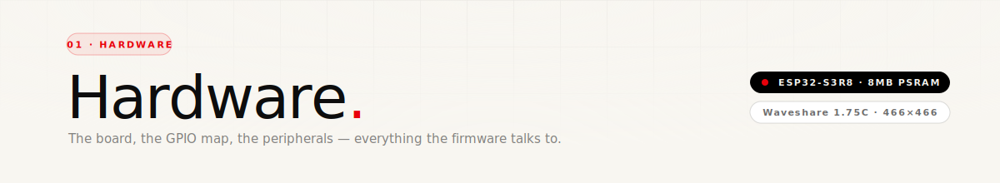

<div align="center">
  
</div>

<p align="center">
  
  
  
</p>

<br/>

## The board

The target is the **Waveshare ESP32-S3-Touch-AMOLED-1.75C**. It's a compact round dev board built around the ESP32-S3R8, with almost every interesting peripheral already wired: AMOLED with touch, an IMU, dual microphones, a speaker, a PMU, and a USB-C with built-in LiPo charging. The whole firmware project is tuned to this exact board — pin assignments, I²C addresses, and the audio routing all assume it.

<br/>

## Peripherals at a glance

| Peripheral | Part | Bus | Address | Notes |
|---|---|---|---|---|
| Display | CO5300 | QSPI | — | 1.75" round AMOLED · 466×466 |
| Touch | CST9217 | I²C | `0x5A` | Capacitive · shares LCD reset pin |
| IMU | QMI8658 | I²C | `0x6B` | 6-axis accel + gyro |
| Mic codec (ADC) | ES7210 | I²C | `0x40` | Dual mic, echo cancellation |
| Speaker codec (DAC) | ES8311 | I²C | `0x18` | Drives onboard AAC transducer via PA |
| PMU | AXP2101 | I²C | `0x34` | Battery monitor, charging, rails |

All I²C peripherals share a single bus on `SDA=GPIO15 / SCL=GPIO14`.

<br/>

## GPIO map

All the pins in one place. Everything below is what the firmware actually drives — if a pin isn't here, it isn't used.

### Display (QSPI)

| Pin | GPIO | Purpose |
|---|---|---|
| `PIN_LCD_CS` | `12` | Chip select |
| `PIN_LCD_SCLK` | `38` | QSPI clock |
| `PIN_LCD_D0` | `4` | QSPI data 0 |
| `PIN_LCD_D1` | `5` | QSPI data 1 |
| `PIN_LCD_D2` | `6` | QSPI data 2 |
| `PIN_LCD_D3` | `7` | QSPI data 3 |
| `PIN_LCD_RST` | `2` | Reset · **shared with touch reset** |

### Touch

| Pin | GPIO | Purpose |
|---|---|---|
| `PIN_TOUCH_INT` | `11` | Touch interrupt (pulled-up input) |
| `PIN_TOUCH_RST` | `2` | Reset (same line as LCD reset) |

### I²C bus

| Pin | GPIO | Purpose |
|---|---|---|
| `PIN_I2C_SDA` | `15` | Shared data line |
| `PIN_I2C_SCL` | `14` | Shared clock line |

### I²S audio

| Pin | GPIO | Purpose |
|---|---|---|
| `PIN_I2S_MCLK` | **`16`** | Master clock (⚠︎ **not 42** — 42 is display SCLK) |
| `PIN_I2S_BCLK` | `9` | Bit clock |
| `PIN_I2S_LRCK` | `45` | Left/right clock |
| `PIN_I2S_DOUT` | `8` | ESP32 → ES8311 (speaker) |
| `PIN_I2S_DIN` | `10` | ES7210 → ESP32 (mic) |
| `PIN_SPEAKER_EN` | `46` | PA amp enable · active HIGH |

### Buttons

| Pin | GPIO | Purpose |
|---|---|---|
| `PIN_BOOT` | `0` | BOOT button · active LOW · internal pull-up |

<br/>

## Power

An **AXP2101 PMU** handles the Li-ion battery: charging, fuel-gauge, voltage rails for the ESP32 and peripherals. The firmware reads battery voltage every 5 s and converts to a percentage using a 3.20 V → 4.15 V range. When `isCharging()` returns true, the reading is compensated down by 5 % (the charge voltage inflates the raw reading).

The battery icon at the top of the face is drawn directly from this: green when > 50 %, white 21–50 %, red ≤ 20 %. If no battery is detected (voltage < 0.5 V), it renders as `NO BATT`.

<br/>

## One-I²C-bus caveat

All six I²C devices live on the same `SDA=15 / SCL=14` pair. The firmware is careful about init order:

```
1. Display  (QSPI — drives GPIO 2 low then high on init)
2. Touch    (I²C — re-toggles GPIO 2, THEN begins Wire)
3. IMU      (Wire already begun from touch init)
4. Battery  (AXP2101 — explicit Wire.begin is redundant here)
```

If you flip the display/touch order, the CST9217 misses its reset window and shows up as "not found" at `0x5A`.

<br/>

## Build toolchain

| | |
|---|---|
| **Build system** | PlatformIO |
| **Framework** | Arduino-ESP32 |
| **Board target** | `esp32-s3-devkitc-1` (generic S3 — pin map is defined in code, not board file) |
| **Display lib** | `GFX Library for Arduino` 1.5.6 (CO5300 QSPI driver) |
| **UI lib** | LVGL 8.4.0 (present, not yet driving the face — the face is drawn directly to the GFX canvas) |
| **BLE stack** | NimBLE-Arduino |
| **PMU lib** | `XPowersLib` |

See [`platformio.ini`](../platformio.ini) for the exact `lib_deps` and build flags.

<br/>

---

<p align="center"><sub>Next up — <a href="./02-face-rendering.md">02 · Face rendering</a> →</sub></p>
