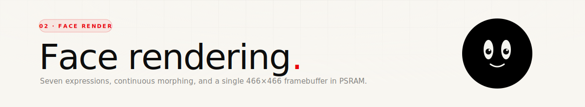

<div align="center">
  
</div>

<p align="center">
  
  
  
</p>

<br/>

## The idea

The face isn't a sprite or a video. Every frame is drawn from primitives — arcs, filled circles, thick lines — against a black background. That means the expression can be **anything in-between two defined expressions**, and it costs nothing: I just lerp the numbers.

There are seven named expressions. Everything you see on the device is either one of those, or a continuous morph between two of them.

<br/>

## The render pipeline

Every frame (30 FPS target, `FRAME_MS = 33`) does this in order:

```
1.  fillScreen(COL_BLACK)          ← nuke the canvas
2.  drawBrow(left)  drawBrow(right)
3.  drawEye(left)   drawEye(right)  ← sclera, pupil, highlight, blink squash
4.  drawMouth()
5.  drawBatteryIcon()               ← top-centre pill
6.  drawControlPanel()              ← only if swipe-up revealed it
7.  flushWithRotation()             ← pixel-rotate framebuffer to match gravity
                                      then push over QSPI to the display
```

The framebuffer is a **466×466 `uint16_t` array (RGB565) in PSRAM** — roughly 434 KB. The `Arduino_Canvas` wrapper holds it, and `canvas->flush()` DMAs it over QSPI in one shot.

<br/>

## The expression system

An expression is a bundle of numbers: how the brows slant, how tall the eyes are, how big the pupils are, what mouth shape to draw, how wide the mouth is, and so on.

```cpp
struct ExpressionDef {
    BrowDef leftBrow, rightBrow;              // brow angles per side
    int browSpread, browCurve, browLen,
        browThick, browGap;
    EyeShape eyeShape;                        // OPEN or CLOSED_U
    int eyeRX, eyeRY;                         // sclera radii
    int pupilR;
    MouthShape mouth;                         // O / SMILE / FROWN / LINE / SMALL_O
    int mouthW, mouthH;
};
```

Seven named expressions, tuned by hand:

| # | Expression | Eyes | Mouth | Vibe |
|---|---|---|---|---|
| `0` | **NEUTRAL** | open · normal pupils | small O | default |
| `1` | **SURPRISED** | wide open · bigger sclera | big O | 😮 |
| `2` | **ANGRY** | narrow sclera · big pupils · slanted brows | flat line | 😠 |
| `3` | **HAPPY** | squashed sclera | smile arc | 😊 |
| `4` | **SAD** | raised-inner brows | frown arc | 🥲 |
| `5` | **THINKING** | asymmetric brow raise on left | tiny O | 🤔 |
| `6` | **PENSIVE** | closed-U eyes | flat line | 😌 |

These live in a single `EXPRESSIONS[EXPR_COUNT]` table in [`main.cpp`](../src/main.cpp). Tuning the face is just editing numbers in that table.

<br/>

## Morphing between expressions

Switching expression never snaps — it lerps. A `morph` struct holds the **current** value of every field, and each frame each field is pulled a little closer to the **target** expression's value:

```cpp
morph.eyeRY = lerpf(morph.eyeRY, target.eyeRY, MORPH_SPEED);  // 0.08
```

With `MORPH_SPEED = 0.08`, any transition settles in about 30 frames — one second. That gentleness is what makes it feel alive rather than switching.

Some fields (`MouthShape`, `EyeShape`) are enums, not numbers — those just snap. In practice the accompanying size fields (`mouthW`, `mouthH`, `eyeRY`) morph around them, so the change still reads as smooth.

<br/>

## Drawing the face

Three primitive helpers do all the work:

### `drawThickLine(x0, y0, x1, y1, thickness, color)`

A thick line is just two triangles rotated into a rectangle, plus a filled circle at each end cap. No antialiasing — on a black OLED at 466×466, aliasing is invisible.

### `drawThickArc(cx, cy, rx, ry, startAngle, endAngle, thickness, color)`

Walks `angle` from start to end in 0.04-radian steps and stamps a filled circle at each point. It's dumb, but it's fast enough and works for any ellipse-arc at any thickness.

### Eyes — `drawEyeWithPupil(...)`

Each eye is three layers:

1. **Sclera** — a white pill (rounded rect with `cornerR = width/2`).
2. **Pupil** — a dark filled circle, positioned by the tracking system (see [03 · Eye tracking](./03-eye-tracking.md)). The pupil is allowed to overflow the sclera edge into the black background, which reads as the pupil being partly hidden behind the eyelid — a free bit of depth.
3. **Highlight** — a tiny white dot at `(+5, -5)` from the pupil centre. One dot is the difference between "pupil" and "eye".

When the eye blinks, only the sclera's vertical radius shrinks — the pupil stays centred. Below 30 % of full-open, the pupil is hidden entirely.

### Closed-U eyes — `drawEyeClosedU(...)`

For the `PENSIVE` expression: just a thick arc shaped like the bottom of a U, no pupil.

### Brows — `drawBrow(...)`

A quadratic Bézier between two endpoints with a curve control in the middle. Each brow has three deltas — `innerDy`, `outerDy`, and `raise` — which together give you every angry / surprised / sad shape the expressions need without introducing any trig.

### Mouths — `drawMouth(...)`

One function, five shapes:

| Shape | Drawn as |
|---|---|
| `MOUTH_O` / `MOUTH_SMALL_O` | Full ellipse (thick arc `0 → 2π`) |
| `MOUTH_SMILE` | Upper half-arc, flipped so it curves up |
| `MOUTH_FROWN` | Lower half-arc, curves down |
| `MOUTH_LINE` | Thick horizontal line |

<br/>

## The battery pill

Top-centre, above the eyes: a rounded-rect battery icon with a filled level inside and a tiny lightning bolt overlaid when it's charging. Colour is data-driven: green > 50 %, white 21–50 %, red ≤ 20 %. The exact pixel coords are in `drawBatteryIcon(int cx, int cy)` in [`main.cpp`](../src/main.cpp).

<br/>

## Colours

```
COL_BLACK      0x0000   pure background
COL_WHITE      0xFFFF   sclera, brows, mouth
COL_RED        0xC0E7   ≈ #C41E3A — accents, low-battery fill
COL_PUPIL      0x1082   very dark grey — slight depth vs pure black
COL_GREEN      0x4EA4   ≈ #4CAF50 — healthy-battery fill
COL_DARK_GREY  0x3186   panel handles, muted text
COL_PLUM       0x3082   control-panel background
```

The on-device red (`#C41E3A`) is slightly warmer than the landing-page red (`#E8000A`) because it reads cleaner on an AMOLED pushing pure black next to it.

<br/>

## Driving the expression from outside

Expressions can be triggered three ways:

1. **Demo cycle** — when no phone is connected, the face rotates through all seven expressions every 5 s.
2. **HTTP** — `POST /face` with a byte 0x00–0x0A (see [05 · Wi-Fi API](./05-wifi-http-api.md)).
3. **Directly in code** — `setExpression(EXPR_HAPPY)`.

HTTP takes priority: as soon as the phone sends a face code, the demo cycle pauses.

<br/>

---

<p align="center"><sub>Next up — <a href="./03-eye-tracking.md">03 · Eye tracking</a> →</sub></p>
