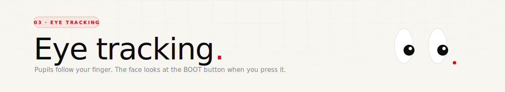
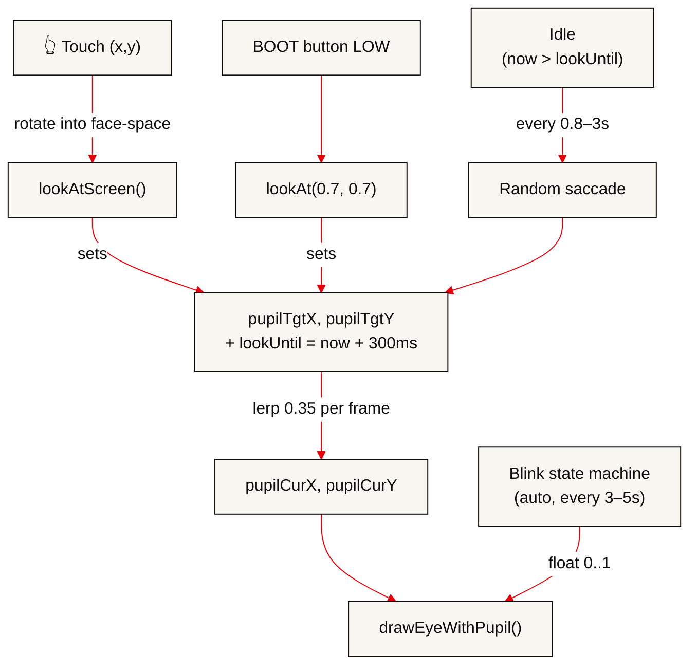

<div align="center">
  
</div>

<p align="center">
  
  
  
</p>

<br/>

## What "eye tracking" actually means here

The device isn't looking at your eyes. **Its eyes are looking at you** — and the cue is wherever you touched the screen last, plus the occasional glance at the BOOT button. The effect is a face that feels present: it notices when you interact, it drifts when you don't, and it blinks on its own.

This doc covers three overlapping systems:

1. **Pupil targeting** — where each pupil should be.
2. **Saccades** — the tiny random re-targeting that happens when nothing else is driving the eyes.
3. **Blinking** — the amplitude multiplier that squashes the sclera every few seconds.

<br/>

## Pupil state

Each eye has the same pupil offset (both eyes look at the same thing — cross-eyed would need per-eye math and wouldn't read well at this scale). So there's one 2D vector of state, not two:

```cpp
static float pupilCurX = 0, pupilCurY = 0;   // current position, lerped
static float pupilTgtX = 0, pupilTgtY = 0;   // target position
```

Every frame, `updatePupils()` lerps `pupilCur` toward `pupilTgt` with `PUPIL_LERP = 0.35`:

```cpp
pupilCurX = lerpf(pupilCurX, pupilTgtX, PUPIL_LERP);
pupilCurY = lerpf(pupilCurY, pupilTgtY, PUPIL_LERP);
```

At 30 FPS, 0.35 lerp settles in about 6 frames — snappy but not teleportation. High enough to feel like intent.

The target is clamped to a circle of radius `MAX_PUPIL_OFFSET = 22`. Anything further gets scaled back onto that circle — the pupils are allowed to ride right up to the sclera edge but never further.

<br/>

## Who sets the target

Three sources, in priority order:

### 1. Touch — `lookAtScreen(screenX, screenY)`

Highest priority. When you tap or drag on the screen, the eyes snap to follow your finger.

```cpp
float dx = screenX - FACE_CX;
float dy = screenY - (FACE_CY + EYE_Y);
float dist = sqrtf(dx*dx + dy*dy);
float tx = (dx / dist) * MAX_PUPIL_OFFSET;
float ty = (dy / dist) * MAX_PUPIL_OFFSET;
setPupilTarget(tx, ty);
lookUntil = millis() + LOOK_DURATION;    // 300 ms hold
```

`lookUntil` gates the saccade logic — so long as "now" is before `lookUntil`, the idle-glance system won't re-target. Lift your finger and 300 ms later the eyes start drifting again.

### 2. BOOT button — `lookAt(0.7, 0.7)`

When you press the BOOT button (GPIO 0, active LOW) the face glances down-right toward it:

```cpp
// In checkButtons()
if (digitalRead(PIN_BOOT) == LOW) {
    lookAt(0.7f, 0.7f);   // unit-vector toward the button's physical position
}
```

`lookAt(dirX, dirY)` takes a unit vector (not pixel coords) and scales it out to `MAX_PUPIL_OFFSET`. The button sits roughly bottom-right of the screen, so `(0.7, 0.7)` points at it in normalised screen space.

### 3. Idle saccades — `updatePupils()` fallback

When nothing's touching and no button is held (`now > lookUntil`), the eyes pick a random new direction every 800–3000 ms:

```cpp
if (now > nextSaccadeTime) {
    float angle  = random(0, 628) / 100.0f;   // radians, 0..2π
    float radius = random(3, MAX_PUPIL_OFFSET);
    setPupilTarget(cosf(angle) * radius, sinf(angle) * radius);
    nextSaccadeTime = now + random(800, 3000);
}
```

The randomised interval keeps the movement from feeling metronomic. Short glances at small radii read as "thinking"; occasional full-reach glances break the monotony.

<br/>

## Rotation-aware touch

Because the screen reorients itself when the device is tilted (see [07 · IMU rotation](./07-imu-rotation.md)), a raw touch at pixel `(100, 400)` doesn't map to the same feature on the face every time. Before the touch feeds `lookAtScreen`, the firmware rotates the point back into face-space:

```cpp
void touchToFaceSpace(int rawX, int rawY, int &faceX, int &faceY) {
    float fx = rawX - 233, fy = rawY - 233;
    float ca = cosf(-currentAngle), sa = sinf(-currentAngle);
    faceX = (int)(fx * ca - fy * sa) + 233;
    faceY = (int)(fx * sa + fy * ca) + 233;
}
```

Same rotation matrix as the framebuffer uses, applied in reverse. Without this, tilting the device sideways would make the eyes look in the wrong direction relative to your finger.

<br/>

## Blinking

Blinks are autonomous. They fire every 3–5 s (base 3000 ms + random 0–2000 ms) and last 200 ms total:

```
 0%    35%          65%         100%   ← progress through 200 ms
 +------+------------+----------+
 eyelid |  closed    | eyelid
 closing|  (held)    | opening
```

The state-machine output is a single float `0..1` — the blink factor — which multiplies `eyeRY` (sclera vertical radius) inside `drawEyeWithPupil`. So during a blink, the sclera squashes from 38 px tall down to 0 (a thin line) and back up.

```cpp
// Schedule the next blink
if (!isBlinking && millis() - lastBlinkTime > nextBlinkInterval) {
    isBlinking = true;
    blinkStartTime = millis();
    nextBlinkInterval = 3000 + random(2000);
}

// During a blink, compute 0..1 amplitude
float getBlinkFactor() {
    if (!isBlinking) return 1.0f;
    float t = (millis() - blinkStartTime) / 200.0f;
    if (t < 0.35f) return 1.0f - (t / 0.35f);   // closing
    if (t < 0.65f) return 0.0f;                 // held shut
    return (t - 0.65f) / 0.35f;                 // opening
}
```

The rule "hide the pupil when `blink < 0.3`" is what sells the closed eye — a half-closed eye with no pupil reads as a squint, then the pupil reappears when the eye opens again.

<br/>

## Putting it together



<br/>

---

<p align="center"><sub>Next up — <a href="./04-ble-pairing.md">04 · BLE pairing</a> →</sub></p>
