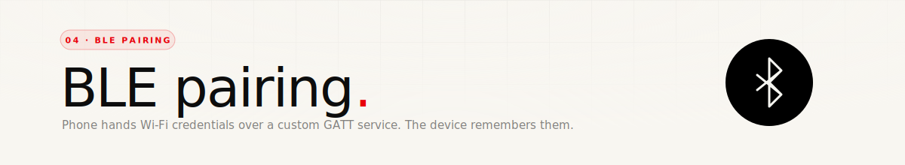
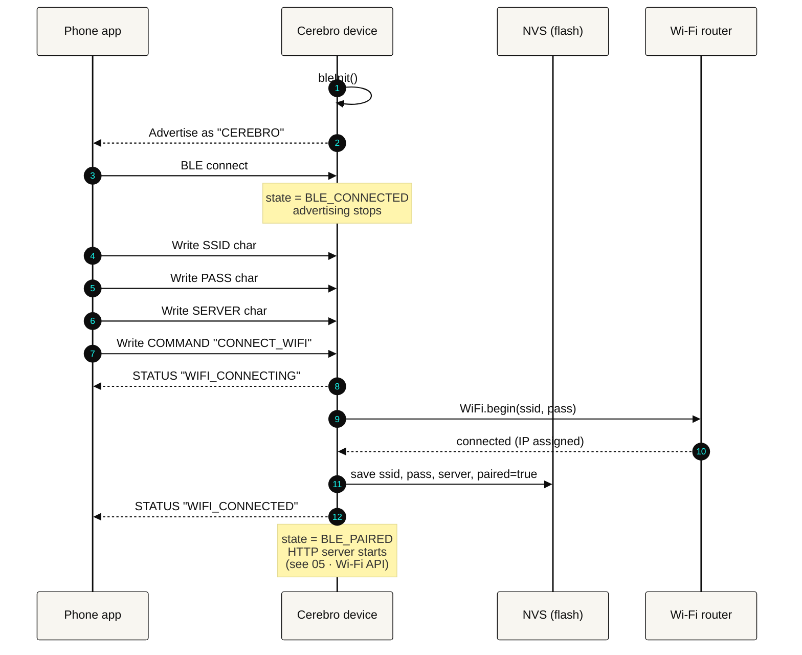

<div align="center">
  
</div>

<p align="center">
  
  
  
</p>

<br/>

## Why BLE at all

After everything works, the phone and device talk over **HTTP on local Wi-Fi** — not BLE. Wi-Fi is faster, has no MTU to fight, and the app's already going to hit a server anyway. But Wi-Fi has a chicken-and-egg problem: the device doesn't know the network's SSID or password.

BLE solves that one problem. **The only job of BLE in Cerebro is Wi-Fi provisioning.** Once the phone has handed over credentials, the device connects to Wi-Fi, saves the creds to NVS, and every subsequent boot reuses them without BLE ever being necessary.

<br/>

## The GATT service

A single custom 128-bit service UUID (`ce3eb000-...`) with five write characteristics and one notify characteristic:

| Characteristic | UUID (last octets) | Property | Payload |
|---|---|---|---|
| SSID | `...0001` | `WRITE` | UTF-8 network name |
| PASS | `...0002` | `WRITE` | UTF-8 password |
| SERVER | `...0003` | `WRITE` | UTF-8 app server address (e.g. `192.168.1.42:3000`) |
| COMMAND | `...0004` | `WRITE` | ASCII command — `CONNECT_WIFI` or `DISCONNECT` |
| STATUS | `...0005` | `READ` + `NOTIFY` | ASCII status string, pushed on state change |
| Audio out (legacy) | `...0010` | `NOTIFY` | Kept for older BLE mic-streaming tests |

MTU is set to 517 (max) so a long Wi-Fi password fits in one write.

Device advertises as **`CEREBRO`** with TX power at `P9` (max) so discovery is reliable across the room.

<br/>

## Pairing flow



If `WiFi.begin` doesn't associate within `WIFI_TIMEOUT_MS = 10000`, the STATUS characteristic pushes `WIFI_FAILED` and the phone can try again without having to re-pair BLE.

<br/>

## Persistence — NVS

All provisioned values go to the ESP32's NVS (non-volatile storage) under namespace `"cerebro"`:

| NVS key | Purpose |
|---|---|
| `wifi_ssid` | Last provisioned network |
| `wifi_pass` | Last provisioned password |
| `server` | App server address |
| `paired` | Bool — have we ever successfully paired? |

On boot, before BLE is even initialised, the firmware tries `tryStoredWifi()`:

1. If `paired == true`, read back `ssid` / `pass` and `WiFi.begin` directly.
2. If it connects, mark `state = BLE_PAIRED` and carry on — BLE still comes up for re-pairing, but the device is immediately useful.
3. If it fails (network moved, password changed, router off), the device falls back to advertising and waits for fresh credentials.

<br/>

## State machine

Only four states, and they cover every real-world case:

| State | Meaning |
|---|---|
| `BLE_OFF` | Init hasn't run yet. Transient. |
| `BLE_ADVERTISING` | Waiting for a phone. Either unpaired, or paired but Wi-Fi is down. |
| `BLE_CONNECTED` | A phone is actively connected over BLE. |
| `BLE_PAIRED` | Wi-Fi is up (the primary "working" state). BLE is passive. |

Transitions:

```
BLE_OFF ──init──► (tryStoredWifi OK?)
                   ├─ yes ► BLE_PAIRED        (and BLE advertises anyway for re-pair)
                   └─ no  ► BLE_ADVERTISING
BLE_ADVERTISING ──phone connects──► BLE_CONNECTED
BLE_CONNECTED ──phone disconnects──► BLE_PAIRED (if Wi-Fi up) or BLE_ADVERTISING
BLE_PAIRED ──COMMAND "DISCONNECT"──► BLE_ADVERTISING (paired flag cleared in NVS)
```

<br/>

## Commands

Only two commands ever go over BLE:

```
CONNECT_WIFI     After the phone has written SSID/PASS/SERVER, tell the device
                 to actually connect and persist.
DISCONNECT       Forget stored credentials, drop Wi-Fi, return to advertising.
                 Used if the user wants to re-pair to a different network.
```

Anything higher-level — triggering the mic, changing the face, playing audio — all goes over HTTP once Wi-Fi is up.

<br/>

## Status strings

What the STATUS characteristic will push:

| Status | When |
|---|---|
| `STATUS_READY` | BLE came up, no pairing attempt yet |
| `STATUS_WIFI_CONNECTING` | `CONNECT_WIFI` received, waiting on router |
| `STATUS_WIFI_CONNECTED` | Associated, IP assigned, credentials persisted |
| `STATUS_WIFI_FAILED` | Timed out — phone should prompt retry |
| `ERROR:No SSID` | `CONNECT_WIFI` received before the SSID write |

<br/>

## Wi-Fi health

After pairing, `bleLoop()` still does one housekeeping job: every 10 s it checks `WiFi.status()`. If the connection has dropped (router restart, out of range), it calls `WiFi.reconnect()` with the same timeout. The device never sits in "I think I'm on Wi-Fi" limbo — either the reconnect succeeds, or `wifiConnected` flips back to `false` and the HTTP server stops serving.

<br/>

---

<p align="center"><sub>Next up — <a href="./05-wifi-http-api.md">05 · Wi-Fi HTTP API</a> →</sub></p>
