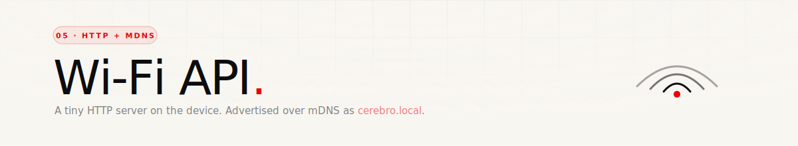

<div align="center">
  
</div>

<p align="center">
  
  
  
</p>

<br/>

## The idea

Once Wi-Fi is up, the device becomes an **HTTP server on port 80**. The phone is the client. That's it — no websockets, no MQTT, no persistent connections. Everything is request / response, which is dead simple to reason about on both ends.

Also advertises itself over **mDNS** as `cerebro.local` with a custom service type `_cerebro._tcp`, so the app doesn't need to know the device's IP — it just browses for the service name.

<br/>

## Discovery

```
Service type:  _cerebro._tcp
Hostname:      cerebro.local
Port:          80
```

On any modern iOS / macOS / Linux device, `http://cerebro.local/info` resolves straight to the firmware. On Windows the phone app does the resolution itself via a Bonjour / zeroconf client.

<br/>

## Endpoints

| Method | Path | Purpose |
|---|---|---|
| `GET` | `/info` | Device name, IP, MAC, firmware version |
| `GET` | `/status` | Full live state — audio, mic, speaker, battery, face |
| `POST` | `/command` | Mic/speaker control + ping (see command table) |
| `POST` | `/face` | Set face expression by code (0x00–0x0A) |
| `POST` | `/audio` | Push raw PCM bytes to the speaker ring buffer |
| `GET` | `/recording` | Download the last mic recording as WAV |

CORS is wide-open (`Access-Control-Allow-Origin: *`) so a browser-based test tool works without fuss. Every route has an `OPTIONS` handler for preflight.

<br/>

## `GET /info`

```json
{
  "name": "CEREBRO",
  "ip": "192.168.1.42",
  "mac": "AA:BB:CC:DD:EE:FF",
  "version": "1.0"
}
```

This is the "handshake" after mDNS resolves — confirms the target is a real Cerebro before the app starts sending commands.

<br/>

## `GET /status`

The workhorse for the phone UI. Poll this at ~2 Hz and drive the app state from the response.

```json
{
  "audio":            "idle" | "recording" | "playing",
  "mic":              true | false,
  "speaker":          true | false,
  "amplitude":        0..255,
  "recording_bytes":  12345,
  "battery":          -1,
  "wifi":             true,
  "face":             -1..10
}
```

- `amplitude` — current speaker output level (0–255). Drives output VU meter.
- `recording_bytes` — current length of the in-progress or last recording.
- `battery` — always `-1` in this response; the device pushes battery separately via the display. (Reserved for a future revision.)
- `face` — last face code pushed via `/face`, or `-1` if nothing has been pushed yet.

<br/>

## `POST /command`

Single-field body. Accepts three formats (whichever is easiest from the client):

- Plain text: `START_MIC`
- Form arg: `cmd=START_MIC`
- JSON: `{"cmd":"START_MIC"}`

All resolve to the same command string. The endpoint then dispatches:

| Command | Effect | Response |
|---|---|---|
| `START_MIC` | Begin recording to PSRAM buffer | `{"ok":true,"status":"recording"}` |
| `STOP_MIC` | Stop recording, keep buffer for later `GET /recording` | `{"ok":true,"bytes":<n>}` |
| `START_SPEAK` | Enable speaker output (codec + PA) | `{"ok":true,"status":"speaker_on"}` |
| `STOP_SPEAK` | Disable speaker | `{"ok":true,"status":"speaker_off"}` |
| `PLAY:<url>` | Stream a WAV/PCM URL into the speaker ring buffer | `{"ok":true,"status":"playing"}` |
| `PING` | Liveness check | `{"ok":true,"status":"pong"}` |

Unknown commands return `400` with `{"ok":false,"error":"unknown command"}`.

<br/>

## `POST /face`

Sets the face expression. Body is a single number, `0x00` to `0x0A`:

| Code | Maps to expression | Semantic meaning (from app) |
|---|---|---|
| `0x00` | `EXPR_NEUTRAL` | neutral |
| `0x01` | `EXPR_HAPPY` | happy |
| `0x02` | `EXPR_THINKING` | thinking |
| `0x03` | `EXPR_SURPRISED` | surprised |
| `0x04` | `EXPR_SAD` | concerned |
| `0x05` | `EXPR_HAPPY` | excited (aliased to happy) |
| `0x06` | `EXPR_NEUTRAL` | calm |
| `0x07` | `EXPR_ANGRY` | alert |
| `0x08` | `EXPR_NEUTRAL` | listening |
| `0x09` | `EXPR_NEUTRAL` | speaking |
| `0x0A` | `EXPR_PENSIVE` | sleeping |

The remap exists so the phone app can keep its own richer vocabulary (10 semantic moods) while the firmware only has to render the 7 it already supports. The app calls "listening" and the device draws "neutral" — the app's concept, the firmware's visual.

Accepts plain number (`5`) or JSON (`{"code": 5}`). Invalid codes return `400`.

As soon as any valid face code has been received, the firmware's **demo-cycle loop stops** — see the last block of `loop()` in [`main.cpp`](../src/main.cpp). If you want the demo back, reboot.

<br/>

## `POST /audio`

Push raw PCM bytes to the speaker's ring buffer. Body is binary — same sample rate and bit depth as the codec is configured for (see [06 · Audio](./06-audio.md)). Response:

```json
{"ok": true, "bytes": 2048}
```

This is how the phone streams TTS audio back to the device without the device needing to fetch a URL.

<br/>

## `GET /recording`

Downloads the last mic recording as a **16-bit mono WAV file** with a proper 44-byte header prepended. Content type is `audio/wav`, `Content-Disposition: attachment; filename="recording.wav"`.

If no recording exists, responds `204 No Content`.

The WAV header is built live from `SAMPLE_RATE`, `BITS_PER_SAMPLE`, and the recording length — it's not stored with the buffer, just generated on the fly when someone asks.

<br/>

## App liveness

The server module tracks `lastAppPing` — any endpoint touch updates it. `wifiAppConnected()` returns `true` if there's been activity in the last 30 s. The firmware doesn't use this aggressively yet, but it's the hook for "show offline indicator when the app stops polling".

<br/>

## Example — full record-and-play round trip

```bash
# Kick off recording
curl -X POST http://cerebro.local/command -d 'START_MIC'

# ... speak ...

# Stop and grab the WAV
curl -X POST http://cerebro.local/command -d 'STOP_MIC'
curl -o me.wav http://cerebro.local/recording

# Send some TTS back to the speaker
curl -X POST http://cerebro.local/command -d 'START_SPEAK'
curl -X POST http://cerebro.local/audio \
     --data-binary @reply.pcm \
     -H 'Content-Type: application/octet-stream'

# Make the face look happy about it
curl -X POST http://cerebro.local/face -d '1'
```

<br/>

---

<p align="center"><sub>Next up — <a href="./06-audio.md">06 · Audio</a> →</sub></p>
