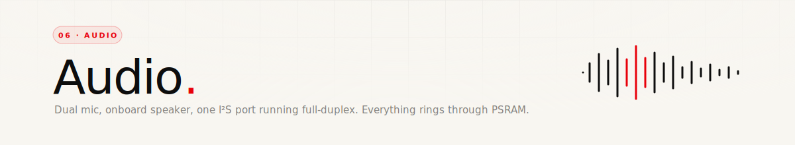

<div align="center">
  
</div>

<p align="center">
  
  
  
</p>

<br/>

## Two codecs, one I²S port

The board has **two separate audio chips**:

- **ES7210** — an ADC, reads the dual-mic array. Also does hardware echo cancellation. I²C address `0x40`, data comes in on `I2S_DIN = GPIO 10`.
- **ES8311** — a DAC, drives a PA amp that drives the onboard AAC transducer (speaker). I²C address `0x18`, data goes out on `I2S_DOUT = GPIO 8`.

Both are clocked by the **same I²S master clock** from the ESP32 on `MCLK = GPIO 16` (⚠︎ not 42, 42 is the display QSPI clock). They share `BCLK = GPIO 9` and `LRCK = GPIO 45`. The speaker PA is gated by `PIN_SPEAKER_EN = GPIO 46`, active HIGH — the firmware pulls it high before playback and low after, so there's no hiss or pop while idle.

All of that runs on **one I²S port (`I2S_NUM_0`) in full-duplex mode**: `I2S_MODE_MASTER | I2S_MODE_TX | I2S_MODE_RX`. One driver, one DMA, one init — mic and speaker both talk to it.

<br/>

## Sample format

```
Sample rate    8000 Hz
Bit depth      16-bit signed
Channels       Mono (but I²S runs stereo — see below)
MCLK           SAMPLE_RATE × 256  (2.048 MHz)
```

The I²S driver is configured with `channel_format = I2S_CHANNEL_FMT_ONLY_LEFT` — it fires one channel at a time. The mic reads pick up mono samples from the ES7210 (channel 0 of the dual-mic array is the "front" mic), and the speaker plays mono out of the ES8311.

8 kHz is deliberate. Voice is fine at that rate, Whisper handles it well, and it halves the bandwidth over Wi-Fi relative to 16 kHz. When playback content comes in as a WAV at a different rate (e.g. 22 050 Hz TTS), the audio task calls `i2s_set_sample_rates()` to match, then reverts to 8 kHz afterward so mic recording stays consistent.

<br/>

## Init order

```cpp
initI2S();       // install driver, set pins, allocate DMA buffers
initES8311();    // configure DAC clocks, set volume, disable its own mic input
initES7210();    // configure ADC, set mic gain to +33 dB, start capture
digitalWrite(PIN_SPEAKER_EN, LOW);   // speaker stays muted until needed
```

Both codecs are I²C-configured over the shared `SDA=15 / SCL=14` bus. The I²S driver pushes silence into the DMA TX buffers on init (`i2s_zero_dma_buffer`) — critical, because a TX buffer full of garbage produces an audible click when the PA is first enabled.

<br/>

## Ring buffers (both in PSRAM)

### Speaker ring — 256 KB

Inbound audio (from `POST /audio`, or streamed from a URL) doesn't play synchronously. It writes into a 256 KB circular buffer in PSRAM, and the audio task reads from it when it's ready.

```
writer:   POST /audio  →  audioSpeakerPush()   →  ringWrite()
reader:   audioTask    →  ringRead()           →  i2s_write()
```

The read side implements a simple pre-buffer: don't start playing until at least **3 seconds of audio (~48 000 bytes)** is buffered. This avoids stuttering on slow Wi-Fi — once playback starts, it keeps going even if new data lags momentarily.

### Recording buffer — 2 MB

Mic recording isn't a stream. It captures into a fixed 2 MB PSRAM buffer (`MAX_AUDIO_SIZE`), which at 8 kHz / 16-bit mono holds **65 seconds** of audio. Once `STOP_MIC` is sent (or silence auto-stops it), the buffer is held and `GET /recording` wraps it in a WAV header and streams it to the phone.

<br/>

## Silence auto-stop

A second way recording stops — without the phone having to send `STOP_MIC`:

| Knob | Value | Purpose |
|---|---|---|
| `SILENCE_THRESHOLD` | `10` | Amplitude below this counts as silence (noise floor is ~7) |
| `SILENCE_TIMEOUT_MS` | `1500` | If 1.5 s of continuous silence, stop |
| `MIN_RECORD_MS` | `1000` | Don't auto-stop in the first 1 s (to let the user start talking) |

The idea: you press the button, speak, stop speaking, and recording ends on its own 1.5 s later. No tap-to-stop required. The amplitude is a running average of `abs(sample)` per DMA frame, normalised into 0–255 (same value `/status` reports as `amplitude`).

<br/>

## Playback from a URL

`POST /command` with `PLAY:https://example.com/reply.wav` triggers this path:

1. The audio task fetches the URL (HTTP or HTTPS — HTTPS uses `WiFiClientSecure` with `setInsecure()`, no cert pinning).
2. Reads the first 44 bytes. If it's a RIFF/WAVE header, extracts the sample rate and calls `i2s_set_sample_rates()` to match. If it's raw PCM, plays those 44 bytes as audio (they're not metadata, they're samples).
3. Streams the body straight into `i2s_write()` in 1 KB chunks.
4. Computes running `speakerAmplitude` per chunk — drives the mouth animation (or at least, could — currently only exposed via `/status`).
5. Restores `SAMPLE_RATE` on the I²S port when done so the next mic recording is consistent.

This path doesn't use the ring buffer — it writes straight to I²S in a blocking loop. Ring buffer is for push-style `POST /audio` input.

<br/>

## DMA stall prevention

The audio task pushes a small silence buffer (`int16_t silenceBuf[256]`) into the I²S TX DMA whenever nothing else is playing. Without it, TX DMA occasionally stalls and the next real playback starts with a glitch. Cheap insurance — negligible CPU, no audible side effect (silence is silence).

<br/>

## The audio task

Runs pinned to **Core 0**, separate from the main loop's Core 1. This matters because the face draws at 30 FPS and the I²S mic reads are a blocking `i2s_read` with a 100 ms timeout — sharing a core would cause frame hitches during recording.

```
Core 0: audioTask              ← I²S, codecs, WAV fetching, ring buffer drain
Core 1: Arduino loop()         ← face rendering, touch, HTTP handlers
```

State is exchanged via a handful of `volatile` flags (`micActive`, `speakerActive`, `wifiPlayRequested`) plus the ring buffer indices (`ringHead`, `ringTail`). No mutex — single producer / single consumer per variable, which the ESP32 handles fine at these rates.

<br/>

## WAV output format

When `GET /recording` fires, this 44-byte header gets prepended on the fly:

```
offset 0    "RIFF"  +  total size (little-endian uint32)
offset 8    "WAVE"
offset 12   "fmt "  +  fmt chunk size (16)  +  PCM marker (1)
offset 22   channels (1)  +  sample rate (8000)  +  byte rate
offset 32   block align (2)  +  bits per sample (16)
offset 36   "data"  +  data size
offset 44   ...PCM samples...
```

Standard uncompressed PCM WAV. Plays in QuickTime / VLC / every browser without conversion.

<br/>

---

<p align="center"><sub>Next up — <a href="./07-imu-rotation.md">07 · IMU rotation</a> →</sub></p>
