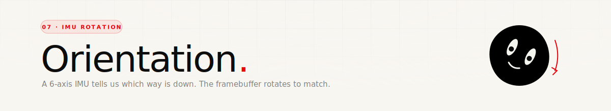

<div align="center">
  
</div>

<p align="center">
  
  
  
</p>

<br/>

## Why bother

The screen is round and the device is hand-held — which means there's no "top" until the user decides there is. Rather than picking an arbitrary orientation and asking the user to hold it right-side-up, the firmware reads the accelerometer and continuously rotates the face so that the chin points toward gravity. You can tilt the device in your hand and the face stays upright.

There's a lock gesture too (swipe up, tap the button) for when you want the face to stay put regardless of tilt.

<br/>

## The sensor

**QMI8658** — 6-axis (3-axis accelerometer + 3-axis gyro), I²C address `0x6B`. WHO_AM_I is `0x05`. The firmware only uses the accelerometer — gyro stays disabled to save power.

Config, written at init:

| Register | Value | Meaning |
|---|---|---|
| `0x60` | `0xB0` | Soft reset, then re-enable |
| `0x02` | `0x60` | CTRL1 — auto increment reads, enable sensor |
| `0x03` | `0x23` | CTRL2 — accelerometer 8 g range, 250 Hz |
| `0x04` | `0x53` | CTRL3 — gyro config (unused but set for safety) |
| `0x06` | `0x00` | CTRL5 — no low-pass filter |
| `0x08` | `0x03` | CTRL7 — enable accelerometer only |

Accelerometer reads from `0x35` (ax lo) through `0x3A` (az hi). Each axis is a signed 16-bit value; divide by 4096 to convert to g (8 g range, 15-bit signed).

<br/>

## From gravity to an angle

Only the X and Y axes matter for face rotation — Z is "into the screen" and doesn't tell us which way is down:

```cpp
float ax = imu_read16(0x35) / 4096.0f;
float ay = imu_read16(0x37) / 4096.0f;
if (fabsf(ax) < 0.05f && fabsf(ay) < 0.05f) return;   // device is flat

float target = atan2f(-ay, ax);
```

`atan2f(-ay, ax)` gives the angle of the gravity vector in screen-space. The sign flip on `ay` accounts for how the sensor is physically mounted on the PCB relative to the display. The "skip if flat" guard prevents jitter when the device is lying face-up — no gravity component in X or Y, so the angle would flap randomly.

<br/>

## Smoothing

The target angle is lerped into `smoothAngle` with a factor of 0.7:

```cpp
float diff = target - smoothAngle;
if (diff > PI) diff -= TWO_PI;      // wrap-around shortest path
if (diff < -PI) diff += TWO_PI;
smoothAngle += diff * 0.7f;
```

0.7 per frame is very aggressive — the rotation settles in about 3 frames (100 ms). The reason it's that snappy: when the device is rotating in the hand, any lag is immediately obvious. A more conservative 0.1 or 0.2 lerp looks like the screen is resisting you.

The ±π wrap handling is there so that going from, say, 170° to -170° takes the 20° shortcut instead of rotating 340° the wrong way.

<br/>

## Rotating the framebuffer

Once you have an angle, you need to actually render the face in that direction. Two options:

1. **Rotate everything at draw time** — recompute every eye/brow/mouth coordinate through a rotation matrix before each `fillCircle` / `drawThickArc`. Lots of math, lots of edge cases, lots of code changes.
2. **Draw upright, then rotate the whole 466×466 framebuffer before flushing.** Simple code, one rotation pass per frame.

The firmware does option 2, in `flushWithRotation()`:

```cpp
void flushWithRotation() {
    if (fabsf(currentAngle) < 0.02f) {      // near-zero? skip the rotation pass
        canvas->flush();
        return;
    }

    uint16_t *fb = canvas->getFramebuffer();
    int cosA = (int)(cosf(-currentAngle) * 1024);   // fixed-point, 10-bit fraction
    int sinA = (int)(sinf(-currentAngle) * 1024);

    for (int y = 0; y < 466; y++) {
        for (int x = 0; x < 466; x++) {
            int fx = x - 233, fy = y - 233;
            int sx = ((fx * cosA - fy * sinA) >> 10) + 233;
            int sy = ((fx * sinA + fy * cosA) >> 10) + 233;
            rotBuf[y * 466 + x] =
                (sx >= 0 && sx < 466 && sy >= 0 && sy < 466) ? fb[sy * 466 + sx] : 0;
        }
    }
    memcpy(fb, rotBuf, 466 * 466 * sizeof(uint16_t));
    canvas->flush();
}
```

Two details worth noting:

- **Fixed-point trig.** The rotation happens once per pixel — 217 156 iterations per frame. Floats would crush the frame rate. Instead, `cosf` and `sinf` are pre-multiplied by 1024 once per frame and the inner loop uses integer math plus an arithmetic shift.
- **A second framebuffer.** `rotBuf` is a full 466×466 PSRAM buffer (~434 KB). In-place rotation would be possible but would need careful ordering of the pixel reads; a second buffer is just simpler and PSRAM is cheap.

Pixels that rotate out of the source area become black (0) — which works because the background is black anyway.

<br/>

## Keeping touch coords honest

If the framebuffer has rotated by 30°, a finger at the "top" of the screen is actually at pixel coords that are 30° off from the face's top. Before any touch coord is fed to the eye tracker, it gets un-rotated back into face-space with the same math:

```cpp
void touchToFaceSpace(int rawX, int rawY, int &faceX, int &faceY) {
    float fx = rawX - 233, fy = rawY - 233;
    float ca = cosf(-currentAngle), sa = sinf(-currentAngle);
    faceX = (int)(fx * ca - fy * sa) + 233;
    faceY = (int)(fx * sa + fy * ca) + 233;
}
```

This is how the control-panel swipe works regardless of orientation — "swipe up from the bottom" means the bottom of the face, not the bottom of the physical screen.

<br/>

## The lock gesture

Auto-rotation is great for idle viewing, annoying when you set the device down tilted on a desk. The fix is a manual lock:

1. **Swipe up** from the bottom of the screen → a plum-coloured control panel slides up.
2. **Tap the big button in the middle** → toggles `rotationLocked`.
3. When locked, `currentAngle` and `smoothAngle` are reset to 0 and `imuUpdateAngle()` exits early on subsequent calls.

The swipe detection itself runs in face-space (same rotation-aware transform above), so "swipe up from the bottom" works in any orientation.

<br/>

## Overhead

One rotation pass per frame at 466×466 is the single biggest CPU cost in the render loop. A couple of shortcuts keep it affordable:

- **Skip entirely if upright.** `if (fabsf(currentAngle) < 0.02f) canvas->flush();` — when the face is already straight up, no rotation pass runs and the frame costs nothing extra.
- **Fixed-point inner loop.** Int-only math in the hot path, no per-pixel `cosf` / `sinf`.

Even with the rotation pass active, the loop still comfortably hits the 30 FPS target. It's visible in the serial monitor — if you tilt the device, frames don't hiccup.

<br/>

---

<p align="center"><sub>That's the tour. Back to the <a href="../README.md">README</a> ←</sub></p>
